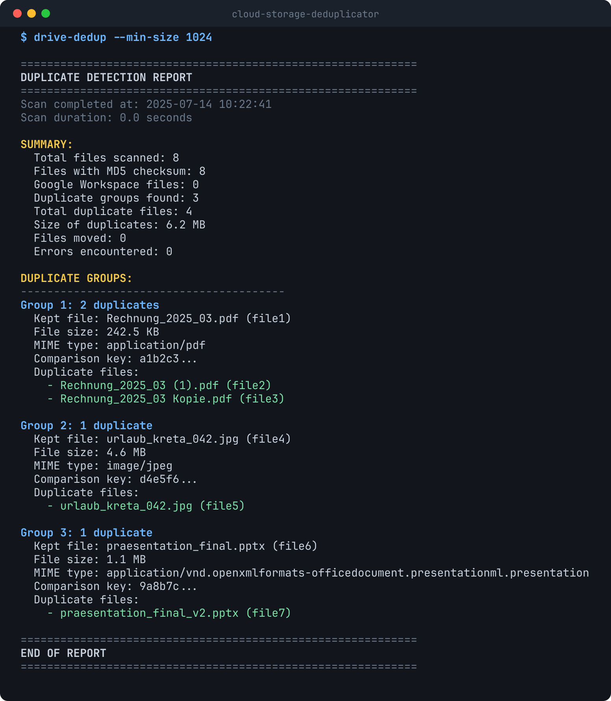
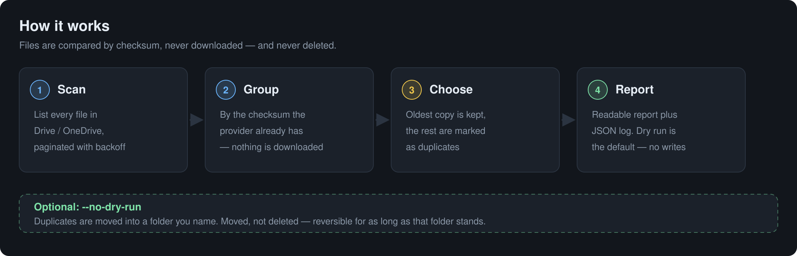

# Cloud Storage Deduplicator

Find duplicate files in **Google Drive** and **OneDrive**, and move them out of the
way — without downloading a single byte and without deleting anything.

[](LICENSE)
[](https://www.python.org/downloads/)
[](#development)

<p align="center">
  
</p>

Cloud storage fills up with the same file three times over — `invoice (1).pdf`,
a photo re-uploaded from a second device, a presentation saved twice. This tool
finds those copies by comparing the checksums your provider already stores, so
nothing has to be downloaded to compare it.

It runs as a **dry run by default**. Nothing changes until you say so, and even
then files are *moved into a folder you choose*, never deleted.

## How it works

<p align="center">
  
</p>

## Features

- **Two providers** — Google Drive and Microsoft OneDrive, one CLI
- **Checksum-based matching** — MD5 on Google, SHA1/SHA256 on OneDrive
- **Dry run by default** — see the full report before anything moves
- **Never deletes** — duplicates are moved to a folder you name
- **Oldest copy wins** — the original stays exactly where it is
- **Built for large accounts** — pagination, configurable concurrency, exponential backoff on rate limits
- **Two logs** — a readable report and a machine-readable JSONL record of every action
- **Resumable batches** — stop and pick up where you left off on huge libraries

## Requirements

- Python 3.11 or higher
- A Google account with a Google Cloud project (for Drive), or a Microsoft account with an Azure AD app registration (for OneDrive)

## Installation

```bash
git clone https://github.com/Mario-Mohar/cloud-storage-deduplicator.git
cd cloud-storage-deduplicator
pip install -e .
```

For development (pytest, black, ruff, mypy):

```bash
pip install -e ".[dev]"
```

## Google Drive setup

1. Open the [Google Cloud Console](https://console.cloud.google.com/) and create a project.
2. Enable the **Google Drive API** for it.
3. Go to **APIs & Services → Credentials → Create Credentials → OAuth client ID**.
4. Application type: **Desktop app**.
5. Download the JSON file and save it as `credentials.json` in the project directory.
6. On the OAuth consent screen, add your own account as a test user.

The first run opens a browser for consent and writes `token.json` next to the
credentials. Both files are gitignored — see [Handling credentials](#handling-credentials).

## OneDrive setup

OneDrive needs your own Azure AD app registration. It is free and takes about
two minutes:

1. Go to [App registrations](https://portal.azure.com/#blade/Microsoft_AAD_RegisteredApps/ApplicationsListBlade).
2. Click **New registration**.
3. Name: `Cloud Deduplicator` (anything you like).
4. Supported account types: **Personal Microsoft accounts only**.
5. Redirect URI: type **Public client/native**, URI `http://localhost:8400`.
6. Click **Register** and copy the **Application (client) ID**.

Pass that ID with `--client-id`. No client secret is needed — the tool uses the
public client flow.

## Usage

### Google Drive

```bash
# Dry run - scan and report, change nothing
drive-dedup

# Move duplicates into a folder you already have
drive-dedup --move-folder-id YOUR_FOLDER_ID --no-dry-run
```

### OneDrive

```bash
# Dry run
drive-dedup --provider onedrive --client-id YOUR_AZURE_CLIENT_ID

# Move duplicates into a folder named "Duplicates" (created if missing)
drive-dedup --provider onedrive --client-id YOUR_AZURE_CLIENT_ID \
  --move-to-folder "Duplicates" --no-dry-run

# List all folders with their IDs
drive-dedup --provider onedrive --client-id YOUR_AZURE_CLIENT_ID --list-folders
```

### Useful options

```bash
# Only consider files larger than 1 MB
drive-dedup --min-size 1048576

# Also match files that have no checksum (see the warning below)
drive-dedup --use-fallback-hash

# Go faster - or slower, if you are being rate limited
drive-dedup --concurrency 10

# Keep both logs
drive-dedup --log-file report.txt --json-log operations.jsonl
```

### A full example

```bash
drive-dedup \
  --provider google \
  --move-folder-id 1ABC123xyz \
  --no-dry-run \
  --min-size 1024 \
  --log-file duplicate_report.txt \
  --json-log duplicate_operations.jsonl \
  --concurrency 8
```

## Command line options

| Option | Default | Description |
|--------|---------|-------------|
| `--provider` | `google` | Cloud provider: `google` or `onedrive` |
| `--client-id` | None | Azure AD Application ID — **required** for `--provider onedrive` |
| `--dry-run` / `--no-dry-run` | `--dry-run` | Report only, or actually move files |
| `--move-to-folder` | None | Name of the folder to move duplicates to |
| `--move-folder-id` | None | ID of the folder to move duplicates to |
| `--list-folders` | False | List all folders with their IDs and exit |
| `--min-size` | 0 | Minimum file size in bytes to consider |
| `--concurrency` | 5 | Max concurrent API operations (1–20) |
| `--log-file` | None | Path for the human-readable report |
| `--json-log` | None | Path for the JSONL operation log |
| `--use-fallback-hash` | False | Match files that have no native checksum |
| `--log-level` | `INFO` | `DEBUG`, `INFO`, `WARNING` or `ERROR` |
| `--credentials-file` | `credentials.json` | OAuth credentials file (Google only) |
| `--account-type` | `personal` | Microsoft account type: `personal`, `work`, `common` |

## How duplicates are decided

**Primary method — checksums.** Google Drive exposes an MD5 checksum, OneDrive a
SHA1 or SHA256 hash. Two files with the same checksum are duplicates. This is
exact, and it needs no downloads.

**Fallback — name + size + MIME type.** With `--use-fallback-hash`, files that
have no checksum are matched on those three properties instead. This is how you
reach Google Workspace files (Docs, Sheets, Slides), which have no checksum at
all — but it **can produce false positives**. Review those matches by hand.

**Which copy survives.** The oldest file by creation date is kept and never
touched. Everything else in the group is a duplicate.

## Handling credentials

`credentials.json`, `token.json` and `onedrive_token.json` grant access to your
account. They are listed in `.gitignore` and must **never** be committed.

If one of them ever does get committed, deleting the file is not enough — the
secret is in the git history. Revoke it at the source:
[Google account access](https://myaccount.google.com/permissions) or
[Microsoft apps](https://account.live.com/consent/Manage).

## Safety

What this tool does **not** do: delete files, change their contents, read their
contents (metadata only), or touch sharing and permissions.

Recommendations:

1. Run a dry run first and read the report.
2. Back up anything you cannot lose.
3. Use `--min-size` to skip tiny files that are often templates or icons.
4. Be careful with `--use-fallback-hash` and review its matches.

## JSON log format

One JSON object per line (JSONL):

```json
{
  "timestamp": "2023-12-07T10:30:45.123456",
  "primary_id": "checksum_or_fallback_hash",
  "kept_id": "1ABC123original",
  "duplicate_ids": ["1DEF456duplicate1", "1GHI789duplicate2"],
  "action": "moved",
  "move_target_folder_id": "1JKL012target",
  "errors": null,
  "file_names": ["original.pdf", "copy1.pdf", "copy2.pdf"],
  "total_size": 3145728
}
```

## Troubleshooting

**`credentials.json not found`**
Download the OAuth credentials from the Google Cloud Console and save them as
`credentials.json` in the project directory.

**`Access blocked: This app's request is invalid`**
The OAuth consent screen is not fully configured. Add your own email as a test
user.

**The browser does not open**
Open the URL printed in the terminal manually.

**`AADSTS...` errors on OneDrive**
Usually temporary on Microsoft's side — try again. If it persists, delete
`onedrive_token.json` and authenticate again.

**Work or school accounts**
These often need admin approval. Register your own Azure AD app and pass it with
`--client-id`.

**`[SSL: WRONG_VERSION_NUMBER]`**
Something is intercepting TLS — a corporate firewall, an antivirus with HTTPS
scanning, a VPN or a proxy. Test on a private network to confirm.

**Timeouts on large libraries**
Lower `--concurrency` to 2–3 and try again; the tool backs off automatically on
rate limits.

**Scanning is slow**
Raise `--concurrency` to 8–10, and use `--min-size` to skip small files.

## Development

```bash
pip install -e ".[dev]"

pytest                       # run the suite
pytest --cov=drive_dedup     # with coverage
black drive_dedup tests      # format
ruff check drive_dedup tests # lint
mypy drive_dedup             # type check
```

### Project structure

```
drive_dedup/
  auth.py             Google OAuth flow
  onedrive_auth.py    Microsoft OAuth flow (public client)
  base_client.py      Shared client interface
  drive_client.py     Google Drive API client
  onedrive_client.py  Microsoft Graph API client
  dedup.py            Grouping, selection, reporting
  models.py           DriveFile, DuplicateGroup, ScanStats, LogEntry
  utils.py            Formatting and logging helpers
  cli.py              Command line interface
tests/                Test suite
```

## Contributing

Issues and pull requests are welcome. Please run `pytest`, `black` and `ruff`
before opening a PR.

## License

MIT — see [LICENSE](LICENSE).
